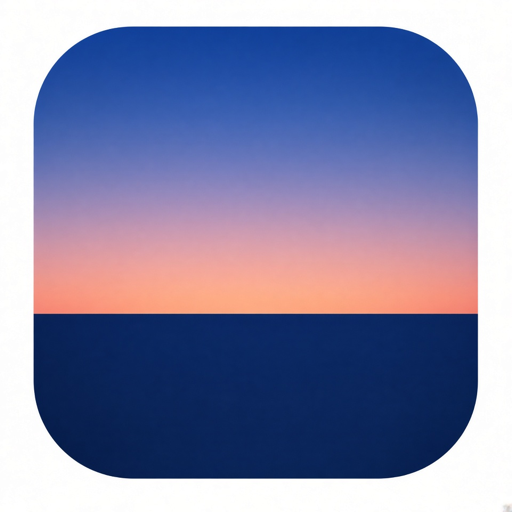

<p align="center">
  
</p>

<h1 align="center">duskline</h1>

<p align="center"><strong>Weather, with a wider view.</strong></p>

<p align="center">A calmer way to check the next hour, plan the week, and see what the sky is doing around the world.</p>

<p align="center"><a href="https://dusklineweather.pages.dev/"><strong>Open duskline ↗</strong></a> · <a href="privacy.html">Privacy</a> · <a href="terms.html">Terms</a></p>

---

<details>
  <summary>Read this README in another language</summary>

  **English** · [Español](docs/i18n/README.es.md) · [Français](docs/i18n/README.fr.md) · [Deutsch](docs/i18n/README.de.md) · [Italiano](docs/i18n/README.it.md) · [Português (Brasil)](docs/i18n/README.pt-BR.md) · [Português (Portugal)](docs/i18n/README.pt-PT.md) · [Nederlands](docs/i18n/README.nl.md) · [Dansk](docs/i18n/README.da.md) · [Svenska](docs/i18n/README.sv.md) · [Norsk bokmål](docs/i18n/README.nb.md) · [Suomi](docs/i18n/README.fi.md) · [Polski](docs/i18n/README.pl.md) · [Čeština](docs/i18n/README.cs.md) · [Magyar](docs/i18n/README.hu.md) · [Română](docs/i18n/README.ro.md) · [Ελληνικά](docs/i18n/README.el.md) · [Türkçe](docs/i18n/README.tr.md) · [Русский](docs/i18n/README.ru.md) · [Українська](docs/i18n/README.uk.md) · [العربية](docs/i18n/README.ar.md) · [עברית](docs/i18n/README.he.md) · [हिन्दी](docs/i18n/README.hi.md) · [ไทย](docs/i18n/README.th.md) · [Tiếng Việt](docs/i18n/README.vi.md) · [Bahasa Indonesia](docs/i18n/README.id.md) · [日本語](docs/i18n/README.ja.md) · [한국어](docs/i18n/README.ko.md) · [简体中文](docs/i18n/README.zh.md) · [繁體中文](docs/i18n/README.zh-TW.md)
</details>

## A forecast that feels at home

duskline balances a quiet, atmospheric sky with the details that help you decide what to do next. Start with your own place in **My Sky**, or open **Horizon** to explore conditions across a curated set of cities.

- **Current conditions, hourly detail, and a 10-day outlook** make it easy to move from “right now” to “what should I plan for?”
- **Useful weather context** includes air quality, feels-like temperature, wind, humidity, UV, pressure, precipitation, and sun times.
- **Saved places and direct links** make it simple to return to the forecasts that matter to you or share a city.
- **U.S. forecasts and public alerts** are supplemented with data from the National Weather Service where available.
- **A living sky** brings day, night, cloud, and precipitation conditions into the city detail view.
- **30 interface languages** include Arabic and Hebrew, with right-to-left layouts.

## Ready when you come back

duskline is an installable progressive web app. Its cached app shell and recent saved forecasts can be opened offline; saved data is labeled with its original check time, and weather alerts need a connection. Forecast snapshots are kept in your browser for up to seven days.

No account or advertising identifier is needed, and duskline has no weather backend of its own. Your language, units, favorites, recent places, and saved forecasts stay in local browser storage. If you use your location, duskline requests permission through your browser and rounds coordinates before storage or weather requests.

## Privacy and weather data

Weather requests go directly from your browser to [Open-Meteo](https://open-meteo.com/) and, for eligible U.S. locations, the [National Weather Service](https://www.weather.gov/). Reverse geocoding for device location uses BigDataCloud and may fall back to OpenStreetMap Nominatim. Hosting and Google Fonts may receive ordinary technical request data.

Forecasts are for planning and exploration, not emergency decisions. Read the [Privacy Policy](privacy.html) and [Terms of Use](terms.html) for details. Removing a saved place removes its forecast snapshot unless the same place remains saved elsewhere; clear the site's browser data to remove all local history.

## For contributors

The app is static HTML, CSS, and classic JavaScript; it has no build step. With Node.js 18 or newer:

```bash
npm install
npm run serve
# Open http://127.0.0.1:8000/
```

Useful checks:

```bash
npm run check       # syntax-check first-party JavaScript
npm run test:unit   # unit and content tests
npm test            # Playwright browser tests
npm run test:all    # both test suites
```

Playwright tests mock the weather providers, so they do not use live API quotas. Localized README files live in [`docs/i18n/`](docs/i18n/README.md); regenerate them with `npm run readme:i18n` after changing their catalog in [`tools/render-readme-i18n.js`](tools/render-readme-i18n.js).

## Hosting

The repository root is the static site. [Cloudflare Pages](https://dusklineweather.pages.dev/) is the primary host; GitHub Pages is the backup. Both publish the repository's static files as-is.

## License

The code is available under the [MIT License](LICENSE). Weather data belongs to its providers and remains subject to their terms. duskline is not an emergency or life-safety service.
